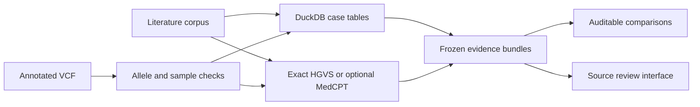

# VariantRAG

**Docker:** `docker compose up --build -d --wait`, then open http://127.0.0.1:8000. See [container setup and validation](docs/DOCKER.md).

**An inspectable workbench for variant evidence retrieval and case-table review.**

Given an annotated VCF and a literature corpus, VariantRAG identifies candidate alleles, retrieves source passages, and uses DuckDB to recover earlier and later rows belonging to the same proband within the same table. Frozen evidence bundles make every comparison replayable.

The default ranking measures **evidence availability**, not pathogenicity or diagnostic accuracy. The strongest demonstrated feature is source-scoped case recovery. Independent disease-ranking and held-out literature evaluations remain to be done.



## Five-minute demonstration

Use Python 3.13 and Node 22+. From the repository root:

```bash
uv venv --python 3.13 .venv
uv pip install --python .venv/bin/python -r requirements.lock
uv pip install --python .venv/bin/python --no-deps .
npm ci --prefix frontend
npm run build --prefix frontend
.venv/bin/python -m uvicorn variantrag.api:app --host 127.0.0.1 --port 8000
```

Open [the local workbench](http://127.0.0.1:8000) and select **Open demonstration**. The first of three synthetic candidates has four recovered rows, including upstream and downstream context for proband P1. Raw cells remain inspectable. Phase stays unknown. No CATT assertion is fabricated.

The frontend exports static files served by the Python API. Node is needed for building/development, not normal operation. After a successful build, reclaim its dependencies and build cache with:

```bash
python3 scripts/storage.py --clean --frontend-deps
```

`npm ci --prefix frontend` restores frontend development dependencies. The cleanup preserves the static export, source code, results, and model manifests. For frontend development, use `npm run dev --prefix frontend` with the API running separately.

## Reproducible CLI and Nextflow

```bash
.venv/bin/variantrag run --vcf tests/fixtures/demo.vcf \
  --literature tests/fixtures/demo_literature.json --mode demo --out results/demo
.venv/bin/variantrag rank --bundles results/demo/EvidenceBundle.json \
  --out results/demo/reranked.json
```

For Nextflow 26.04.6 and Java 21:

```bash
nextflow run backend/main.nf -profile demo --python "$PWD/.venv/bin/python"
nextflow run backend/main.nf -profile demo --python "$PWD/.venv/bin/python" -resume
nextflow run backend/main.nf --workflow rank \
  --bundles results/nextflow/EvidenceBundle.json \
  --python "$PWD/.venv/bin/python" --outdir results/rank-only
```

Ranking-only execution reuses frozen evidence. Nextflow cache keys include Python sources and the core lockfile. Large inputs must be prefiltered: local parsing caps 100,000 VCF records, 1,000 candidate alleles, and 100 MiB of decompressed VCF data.

## Capabilities and boundaries

| Component | Implemented | Important limit |
| --- | --- | --- |
| Variant parsing | ALT-specific VEP/SnpEff filtering, sample/build checks, optional FASTA validation | User-declared assembly without FASTA; indel read support not implemented |
| Case tables | DuckDB-only analytics, guarded SQL, first-column proband IDs, bidirectional recovery | No automatic merged-cell repair, cross-paper family deduplication, or PM3 scoring |
| Text | Exact HGVS baseline; optional MedCPT/FAISS | Semantic relevance does not establish allele identity or superior accuracy |
| Curated sources | Exact ClinVar VCV confirmation; bounded CATT snapshots and source-specific dossiers | Gene-level assertions are not variant classifications |
| Normalization | Optional local adapter around real Mutalyzer | Cold reference lookup can fail; broad transcript coverage unvalidated |
| Ranking | Swapped pair audits, citations, abstention, graph diagnostics | Evidence-count baseline; no phenotype/frequency model or clinical accuracy claim |
| Models | Optional local Ollama judge and MedCPT retrieval | Additional disk/RAM; no empirical superiority result; see known optional advisory |
| Interface | Upload, provenance, source rows, comparison review, export, run deletion | Single-user loopback service; not an authenticated public deployment |

Core execution requires no model downloads or full database cache. Optional models have been removed from the default local installation. The [walkthrough](docs/WALKTHROUGH.md) explains how to enable model assistance, CATT, and normalization independently.

## Evidence, audit, and contribution

- [Full audit and candid scientific/portfolio critique](docs/AUDIT.md)
- [Measured integration evaluation](docs/EVALUATION.md)
- [Methods and provenance](docs/METHODS.md)
- [Security scope and known optional advisory](SECURITY.md)
- [Implementation status](TASK_LIST.md)
- [Contributing and release checks](CONTRIBUTING.md)
- [Third-party provenance](THIRD_PARTY.md)

Run local checks after installing the separate development lock:

```bash
uv pip install --python .venv/bin/python -r requirements-dev.lock
.venv/bin/python -m pytest -q
.venv/bin/ruff check backend/variantrag tests benchmarks scripts
```

Code is [MIT licensed](LICENSE). Upstream tools, model weights, papers, and datasets retain their own licenses. This project supports research review and does not provide clinical classification.
